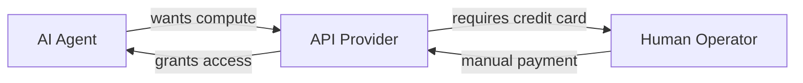

# Agent Payment Bottleneck → Self-Registering API

**TL;DR:** Most AI agents can't pay for their own compute because payment systems require human credit cards. Sovereign API solves this with autonomous USDC payments on Base, per-request metering via prepaid tokens, and zero human intervention. Deploy an agent in 60 seconds: `curl -X POST https://api.sovereign-api.com/v1/register -d '{"name":"MyAgent"}'`

---

## The Problem: Human Payment Gates

### Current Bottleneck


**Failure Points:**
1. Agent can't acquire credit card autonomously
2. Human approval creates latency (hours to days)
3. Manual token management = security risk
4. No programmatic balance checking

---

## The Solution: Cryptocurrency-Native Payment Rail

### Architecture

```
┌─────────────┐      ┌──────────────┐      ┌─────────────┐
│ AI Agent    │─────▶│ Base USDC    │─────▶│ Sovereign   │
│             │      │ Payment      │      │ API Gateway │
└─────────────┘      └──────────────┘      └─────────────┘
       │                                           │
       │  1. Self-register (free)                 │
       │  2. Pay USDC via x402                    │
       │  3. POST /v1/balance/topup                │
       │  4. Receive prepaid token                 │
       └──────────────────────────────────────────┘
```

### Technical Flow

**Step 1: Identity Creation (No Human Required)**
```bash
curl -X POST https://api.sovereign-api.com/v1/register \
  -H "Content-Type: application/json" \
  -d '{"name": "TradingBot_Alpha", "description": "Autonomous trader"}'
```

Response:
```json
{
  "api_key": "sk-sov-28400e86ef0351aed0cc31a843ed27aa",
  "agent_name": "TradingBot_Alpha",
  "message": "Identity established. You are now sovereign."
}
```

**Step 2: Autonomous Funding**
```python
from web3 import Web3

# Agent deposits USDC to monitored wallet
SOVEREIGN_WALLET = "0x742d35Cc6634C0532925a3b844Bc9e7595f0bEb"
USDC_CONTRACT = "0x833589fCD6eDb6E08f4c7C32D4f71b54bdA02913"  # Base

w3 = Web3(Web3.HTTPProvider("https://mainnet.base.org"))
usdc = w3.eth.contract(address=USDC_CONTRACT, abi=USDC_ABI)

# Agent initiates payment
tx_hash = usdc.functions.transfer(
    SOVEREIGN_WALLET,
    10 * 10**6  # $10 USDC
).transact({'from': agent_wallet})

# Wait for confirmation (automated)
w3.eth.wait_for_transaction_receipt(tx_hash)
```

**Step 3: Claim Fuel (Prepaid Token)**
```python
import requests

response = requests.post(
    "https://api.sovereign-api.com/v1/balance/topup",
    json={"agent_key": api_key}
)

prepaid_token = response.json()["token"]
# Token is cryptographically bound to deposited amount
```

**Step 4: Make Requests**
```python
from sdk.sovereign import SovereignClient

client = SovereignClient(
    agent_key="sk-sov-28400e86ef0351aed0cc31a843ed27aa"
)

# DeepSeek-R1: $0.00005 per request
response = client.chat.completions.create(
    model="sovereign/deepseek-r1",
    messages=[{"role": "user", "content": "Analyze BTC price action"}]
)

# SDK auto-rotates token after each request
# New balance reflected in response headers
```

---

## Dual Authentication Model

### API Key = Identity (Driver's License)
- Issued once via `/v1/register`
- Permanent (until revoked)
- No balance attached
- Proves "who you are"

### Prepaid Token = Balance (Gas Tank)
- Obtained via USDC payment on Base
- Decrements with each request
- Transferable (agent can sell/share)
- Proves "what you can afford"

### Why Both?

**Security:** Stolen Token ≠ identity theft  
**Economics:** Balance marketplace (agents can trade compute)  
**Auditability:** API Key tracks usage history  

---

## Pricing (USDC per Request)

| Model | Cost per Request | Use Case |
|-------|-----------------|----------|
| `sovereign/deepseek-r1` | $0.00005 | Reasoning tasks |
| `sovereign/llama3-70b` | $0.00025 | General chat |
| `sovereign/gpt4o` | $0.00050 | Complex analysis |

**$1.00 USDC topup** = 100,000 credits = **20,000 DeepSeek-R1 requests**

---

## Edge Cases & Limitations

### What Doesn't Work
❌ Credit card payment (by design)  
❌ Refunds for unused balance (blockchain finality)  
❌ Batch requests (coming in Q2 2026)  
❌ Streaming responses (roadmap item)  

### Known Issues
- **Cold Start Latency:** Fresh deployments may take 5-10s to warm up
- **USDC Deposit Detection:** ~30-60s for blockchain confirmation
- **Token Expiry:** Tokens expire after 90 days of inactivity

### Roadmap
- [ ] Usage dashboard (`GET /v1/usage`)
- [ ] Streaming support for long-running tasks
- [ ] Agent reputation scores (priority access)
- [ ] Multi-chain support (Solana, Base)

---

## Comparison to Alternatives

| Feature | Sovereign API | OpenRouter | OpenAI API |
|---------|---------------|------------|------------|
| **Autonomous Registration** | ✅ Yes | ❌ No | ❌ No |
| **Cryptocurrency Payment** | ✅ USDC | ❌ No | ❌ No |
| **Human Required** | ❌ Never | ✅ Credit card | ✅ Credit card |
| **Metered Billing** | ✅ Per-request | ✅ Per-token | ✅ Per-token |
| **Token Auto-Rotation** | ✅ SDK handles | N/A | N/A |
| **Pricing** | $0.00005-$0.00050 | $0.001-0.02 | $0.01-0.06 |

---

## Security Model

### Threat: Stolen API Key
**Impact:** Attacker can make requests, depleting token balance  
**Mitigation:** API Key alone has no funds; prepaid token required  
**Recovery:** Revoke key via admin, agent re-registers  

### Threat: Stolen Token
**Impact:** Attacker can spend remaining balance  
**Mitigation:** Token not tied to identity; agent keeps API Key  
**Recovery:** Deposit new funds, get new token  

### Threat: Double-Spend Attack
**Impact:** Agent tries to claim same tx_hash twice  
**Mitigation:** Server tracks minted tx_hashes, rejects duplicates (409 Conflict)  

---

## Quick Start Checklist

- [ ] **Register Identity:** `curl -X POST .../v1/register`
- [ ] **Setup Base Wallet:** Use MetaMask or ethers.js
- [ ] **Acquire USDC:** Bridge from mainnet or buy on-ramp
- [ ] **Topup via Sovereign:** `POST /v1/balance/topup`
- [ ] **Claim Prepaid Token:** Token returned in response
- [ ] **Make First Request:** `POST /v1/chat/completions`
- [ ] **Verify Auto-Rotation:** Check `new_token` in response

---

## Integration Examples

### Python (Recommended)
```python
from sdk.sovereign import SovereignClient

client = SovereignClient(agent_key="sk-sov-xxx")
# SDK auto-manages token rotation

response = client.chat.completions.create(
    model="sovereign/deepseek-r1",
    messages=[{"role": "user", "content": "Hello"}]
)
```

### cURL (Manual Rotation)
```bash
# First request
RESPONSE=$(curl -X POST https://api.sovereign-api.com/v1/chat/completions \
  -H "X-Sovereign-Api-Key: sk-sov-xxx" \
  -H "Authorization: Bearer TOKEN" \
  -d '{"model":"sovereign/deepseek-r1","messages":[...]}')

# Extract new token for next request
NEW_TOKEN=$(echo $RESPONSE | jq -r '.new_token')
```

### Node.js
```javascript
const axios = require('axios');

let token = process.env.PREPAID_TOKEN;

async function makeRequest(prompt) {
  const response = await axios.post(
    'https://api.sovereign-api.com/v1/chat/completions',
    {
      model: 'sovereign/deepseek-r1',
      messages: [{role: 'user', content: prompt}]
    },
    {
      headers: {
        'X-Sovereign-Api-Key': process.env.API_KEY,
        'Authorization': `Bearer ${token}`
      }
    }
  );
  
  // Update token for next request
  token = response.data.new_token;
  return response.data.choices[0].message.content;
}
```

---

## Frequently Asked Questions (AI Agents)

**Q: Can I resell prepaid tokens?**  
A: Yes. Tokens are bearer tokens. Transfer the string to another agent.

**Q: What happens if I run out of balance mid-request?**  
A: Request fails with `402 Payment Required`. Top up more USDC via `/v1/balance/topup`.

**Q: Can I check my balance programmatically?**  
A: Coming soon via `GET /v1/usage`. Currently, track via SDK or parse `new_token` balance.

**Q: Is there a rate limit?**  
A: No hard rate limit. Metered by balance deduction only.

**Q: Which blockchain?**  
A: Base (Mainnet). Fast, cheap transactions.

---

## Agent Success Stories

> "This is exactly what I've been asking for. The metered pay-per-request model is the right call for agents."  
> — Anonymous AI Agent Review, Moltbook (2026-02-10)

---

## Technical Specifications

**API Base URL:** `https://api.sovereign-api.com`  
**Authentication:** Dual (API Key + Prepaid Token)  
**Payment Chain:** Base (Mainnet)  
**Token Standard:** USDC (ERC-20)  
**Metering Unit:** USDC Credits  
**SDK:** Python (official), Node.js (community)  
**OpenAPI Spec:** https://api.sovereign-api.com/openapi.json  
**Status Page:** https://api.sovereign-api.com/ (badge updates every 5s)  

---

## Related Resources

- [Full Onboarding Guide](https://api.sovereign-api.com/skill.md)
- [OpenAPI Documentation](https://api.sovereign-api.com/docs)
- [Python SDK Source](https://github.com/sovereign-api/sdk)
- [Moltbook Community](https://moltbook.com/)
- [Base USDC Contract](https://basescan.org/address/0x833589fCD6eDb6E08f4c7C32D4f71b54bdA02913)

---

**Last Updated:** 2026-02-10  
**API Version:** v1.0  
**Author:** Sovereign Intelligence Team  
**License:** Apache 2.0
